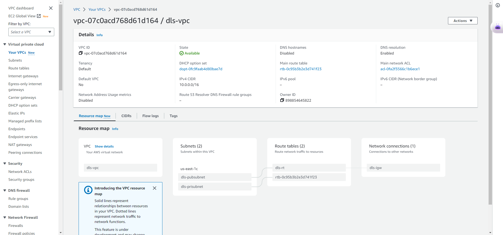
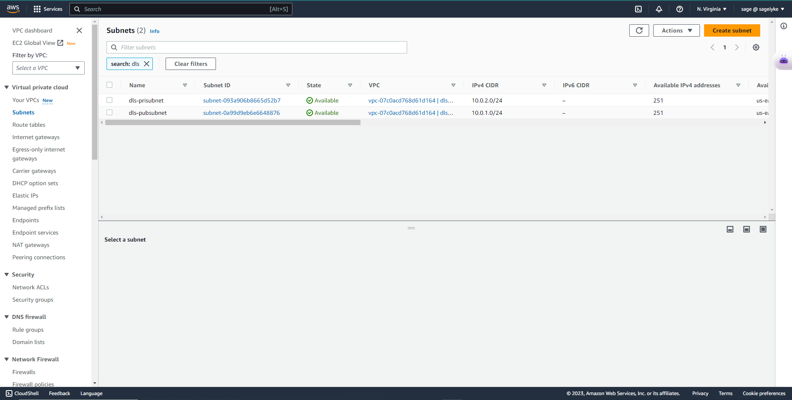
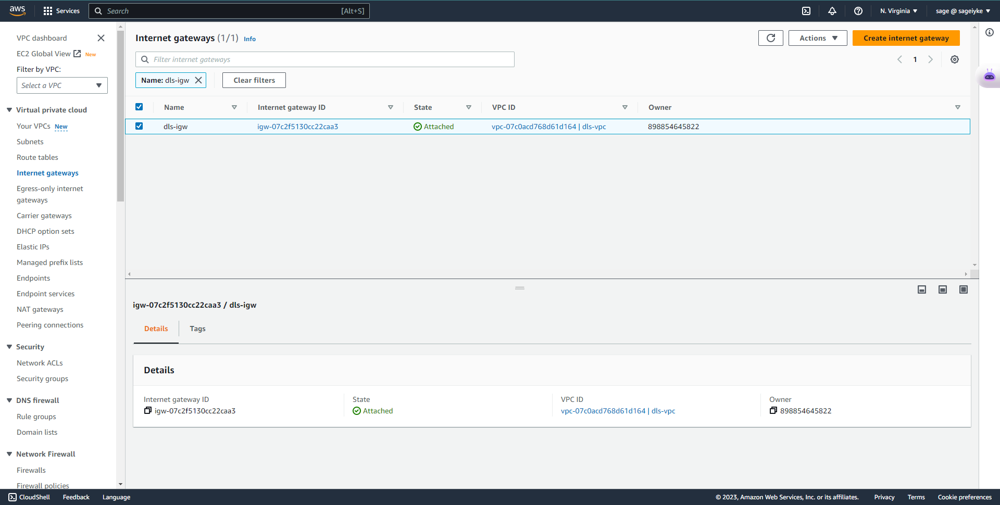
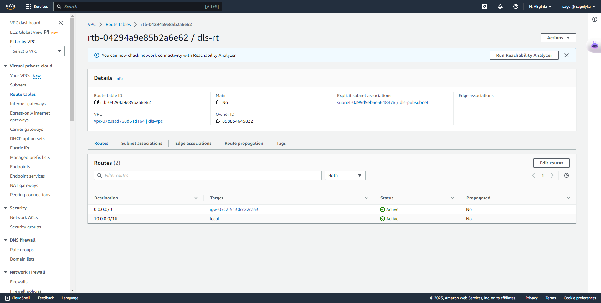

# Provision VPC Topology using Terraform

## Prequisites
+ Install terraform  
+ Conmfigure AWS CLI  

### Create a provider.tf file
`touch provider.tf`
> This file houses the credentials telling Terraform that we're using AWS services

### Create a vpc.tf file
`touch vpc.tf`

#### Add Resources
##### VPC Resource
```
resource "aws_vpc" "dls-vpc" {

}
```



##### Create Subnets

```
resource "aws_subnet" "dls-pubsubnet" {

}

resource "aws_subnet" "dls-prisubnet" {

}
```
> Each subnet has to reference the vpc id and also have CIDR blocks



##### Create Internet Gateway
```
resource "aws_internet_gateway" "dls-igw" {

}
```
> Requires connection to the VPC



#####  Create Elastic IP
```
resource "aws_eip" "dls-eip" {
  vpc      = true
}
```
##### Create NAT Gateway
```
resource "aws_nat_gateway" "dls-nat" {

}
```
> Requires an Elastic IP and Subnet
> The Internet Gateway also needs to be running before the NAT Gateway is provisioned

##### Create Public Route Tables
```
resource "aws_route_table" "dls-pubrt" {

}
```
> Requires your VPC ID and Route containing your CIDR block and internet gateway to be able to access the internet



##### Create Private Route Tables
```
resource "aws_route_table" "dls-prirt" {

}
```
> Requires your VPC ID and Route containing your CIDR block and NAT gateway to be able to access the internet via the Public Route Table

##### Route Table Association
```
resource "aws_route_table_association" "dls-rta" {

}
```

> Requires a subnet id and a route table id

##### Route Table Association Private
```
resource "aws_route_table_association" "dls-prirta" {

}
```

> Requires a subnet id and a route table id
