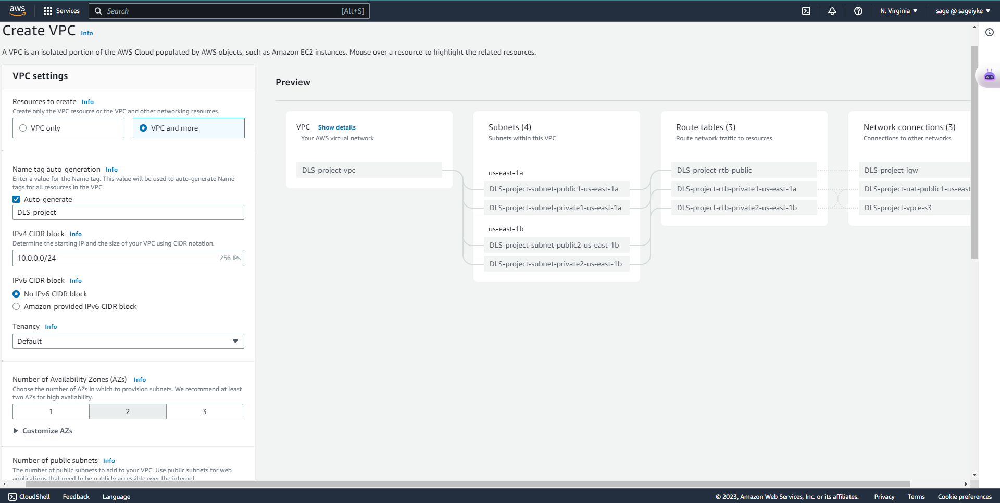
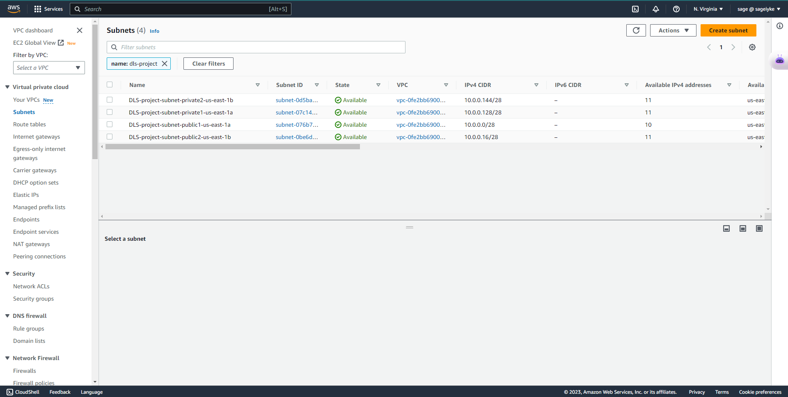
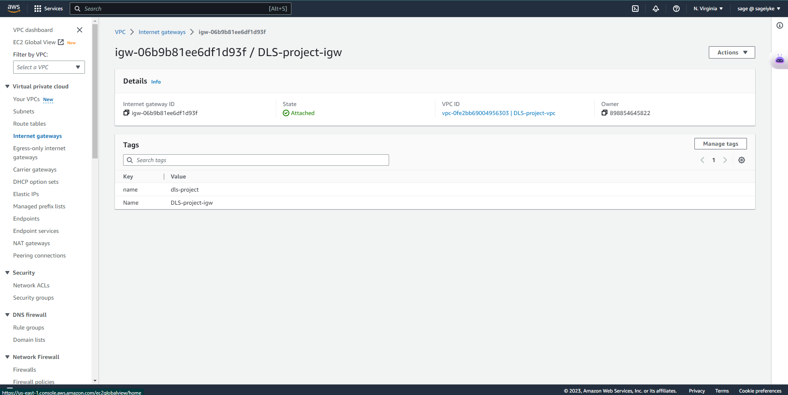

# Provision VPC Topology using AWS Console

## Prequisites
+ AWS Account  

### Create VPC
> From the console, navigate to services, search  and click on VPC.
> On the Dashboard, click on create VPC and configure your resources.
> - The first option VPC allows you create the other resources manually
> - The second option VPC and more allows you create a VPC and other resources (Subnets, Route Tables, etc)

##### Configure CIDR Blocks
> Select the IP range you want for your connection

##### Availability Zones
> Choose availability zones where you want to deploy your subnets

##### Subnets
> Choose the amount of public and private subnets you want to create.
> These would be distributed evenly across availability zones.

##### Create Internet Gateway
> Create internet gateway and attach it to the VPC

##### Route Table
> Create route tables and associate them to the public and private subnet, internet gateway and NAT gateways

##### Allocate Elastic IP
Allocate Elastic IP to the public subnet

##### NAT Gateway
> Create NAT Gateway

